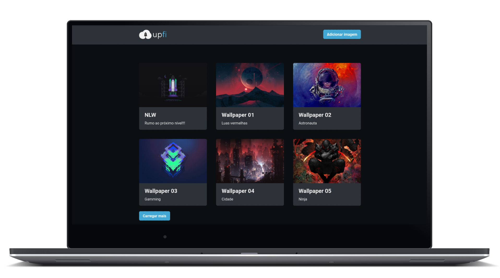
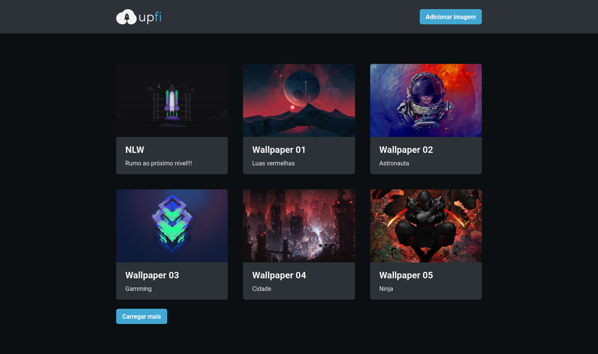
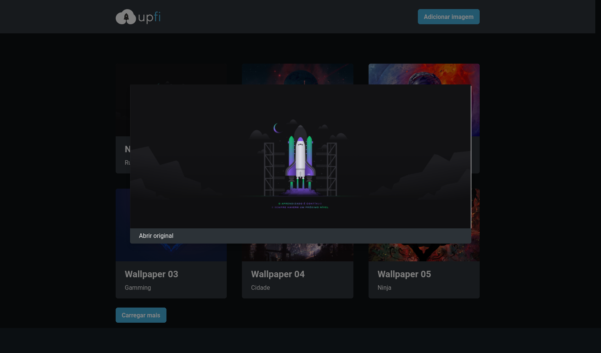
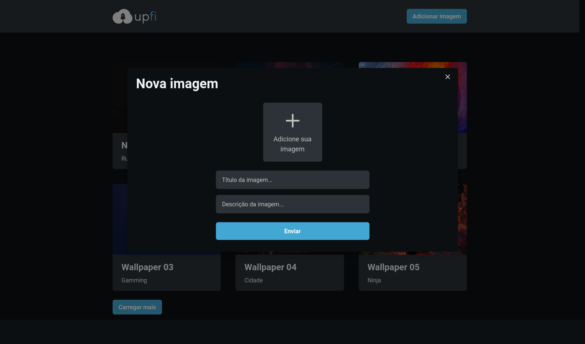

<div 
  align="center"
  style="
    background: #0B0F12;
    border-radius: 1.5rem;
    display: flex;
    alight-itens:center;
    justify-content: center;
    flex-direction: column;
    padding: 10px 60px;
    margin: 10px 20px;
    border: 2px solid #444444;
  ">
  
  <h1 align="center">
      
  </h1>  
  
   [](LICENSE.md) 
    
   
  
  
<!--   ![GitHub][repository_license_badge] ![React_Badge][web_react_badge] ![Types][typescript_shields] ![Next][next_shields] -->
  
</div>

<div align="center">

<br>


<p align="center">
  <strong>
      <a href="#-projeto">Projeto</a> &nbsp;|&nbsp; 
  </strong>
  <strong>
      <a href="#-layout">Layout</a> &nbsp;|&nbsp; 
  </strong>
  <strong>
      <a href="#-tecnologias">Tecnologias</a> &nbsp;|&nbsp; 
  </strong>
  <strong>
      <a href="#-como-executar-o-projeto">Executando</a> &nbsp;|&nbsp; 
  </strong>
  <strong>
      <a href="#-referências">Referências</a> &nbsp;|&nbsp; 
  </strong>
  <strong>
      <a href="#-autor">Autor</a> 
  </strong>
</p>

<p align="center">
  
</p>
</div>


---

## **💻 Projeto**

Upfi é um prototipo de um site de uploads de imagems onde artistas podem divulgar suas obras.

---

## **🔖 Layout**

Você pode visualizar o layout do projeto no formato através [desse link](https://www.figma.com/file/TGxFddsg7zuINXDi1wOMNI/Desafio-2-M%C3%B3dulo-4-ReactJS?node-id=511%3A2). Lembrando que você irá precisar ter uma conta no [Figma](http://figma.com/).

#### **Web**

  <div>
    <br/>
    
    <br/>
    <br/>
    
    <br/>
    <br/>
    
  <div>

---

## **💻 Tecnologias**


 #### **Website** ([React][react])
 
  - **[Typescript][typescript]**
  - **[Next.js][next]**
  - **[FaunaDB][faunadb]**
  - **[React Hook Form][react_hook_form]**
  - **[Chakra UI][chakraui]**
  - **[ImgBB][imgbb]**
  - **[Axios][axios]**
   
> \* Veja o arquivo <kbd>[package.json](./package.json)</kbd>

 #### **Utilitários**
 
  - Editor: **[Visual Studio Code][vscode]**
 - Markdown: **[StackEdit][stackedit]**, **<kbd>[Markdown Emoji][markdown_emoji]</kbd>**

---

##  **🚀 Como executar o projeto**

### Configurações Iniciais

Primeiro, você precisa ter o <kbd>[NodeJS](https://nodejs.org/en/download/)</kbd> instalado na sua máquina. 

Se você estiver utilizando o **Linux**, você pode optar por instalar o **Node** através do gerênciador de versões <kbd>[asdf]</kbd> para facilitar o processo de mudança da versão do **Node**, quando for necessário.

Você pode optar também por utilizar o **yarn** no lugar do **npm**. Você pode instalar clicando nesse <kbd>[link][yarn]</kbd>, ou através do <kbd>[asdf]</kbd>.

Após ter o **Node** instalado, instale as dependências do **React** de forma global, utilizando os comandos:

Instale as dependências contidas nos arquivos `package.json` que se encontram na raíz do repositório. Para instalar as dependências, basta abrir o terminal no diretório e digitar o comando:

```sh
$ npm install

# ou
$ yarn
```

> Veja a parte de **scripts {}** do arquivo <kbd>[package.json](./package.json)</kbd> para saber quais scripts estão disponíveis.


### Executando o WebSite

```sh
# Executando o website no modo de desenvolvimento:
$ npm run dev

#    OU

$ yarn dev
```
> Se o browser não abrir automaticamente, acesse: http://localhost:3000.
---

## **📚 Referências**

- [Blog Rocketseat][rocketseat_blog]
- [Rocketseat][rocketseat_plataforma]
- [ReactJS][react_doc] | [ReactJS pt-BR][react_doc_ptbr]
- [Next.js][next]
- [Node.js][node]


## **👨‍🚀 Autor**

<a href="https://github.com/jairodoni">
 
  <br />
  <sub>
    <b>Jairo Doni Prudente Junior</b>
  </sub>
</a>
<br />

👋 Entre em contato!

[](https://www.linkedin.com/in/jairodoni/)
[](mailto:jairo.doni97@gmail.com)


## **📝 Licença**

Esse projeto está sob a licença MIT. Veja o arquivo [LICENSE](LICENSE.md) para mais detalhes.


<!-- Referencias -->

[rocketseat_blog]: https://blog.rocketseat.com.br/

[rocketseat_plataforma]: https://app.rocketseat.com.br/

[rocketseat_site]: https://rocketseat.com.br/

<!-- Badges -->

[repository_license_badge]: https://img.shields.io/github/license/JairoDoni/NLW-1.0

[web_react_badge]: https://img.shields.io/badge/web-react-blue

[typescript_shields]: https://img.shields.io/badge/types-Typescript-blue

[next_shields]: https://img.shields.io/badge/vercel-Next.js-lightgrey


<!-- Techs -->

[react]: https://reactjs.org/

[react_doc]: https://reactjs.org/docs/getting-started.html

[react_doc_ptbr]: https://pt-br.reactjs.org/docs/getting-started.html

[node]: https://nodejs.org/en/

[json_server]: https://github.com/typicode/json-server

[next]: https://nextjs.org/

[vscode]: https://code.visualstudio.com/

[typescript]: https://www.typescriptlang.org/

[axios]: https://github.com/axios/axios

[faunadb]: https://fauna.com

[react_hook_form]: https://react-hook-form.com

[chakraui]: https://chakra-ui.com

[imgbb]: https://pt-br.imgbb.com

[asdf]: https://github.com/asdf-vm/asdf

[yarn]: https://classic.yarnpkg.com/en/docs/install/#debian-stable

[stackedit]: https://stackedit.io

[markdown_emoji]: https://gist.github.com/rxaviers/7360908


